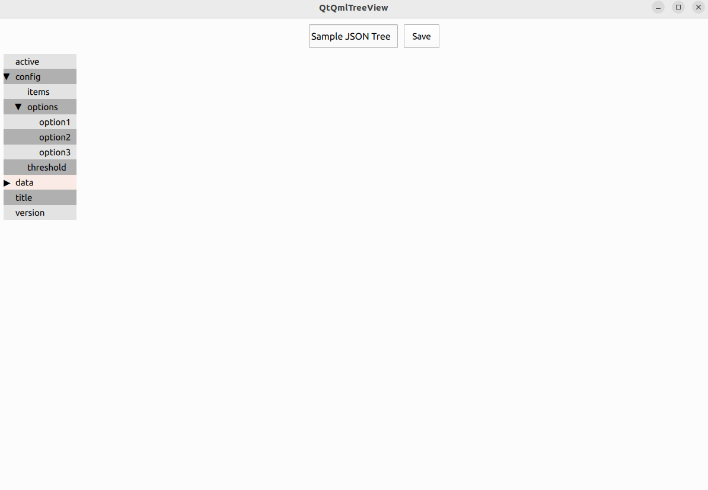
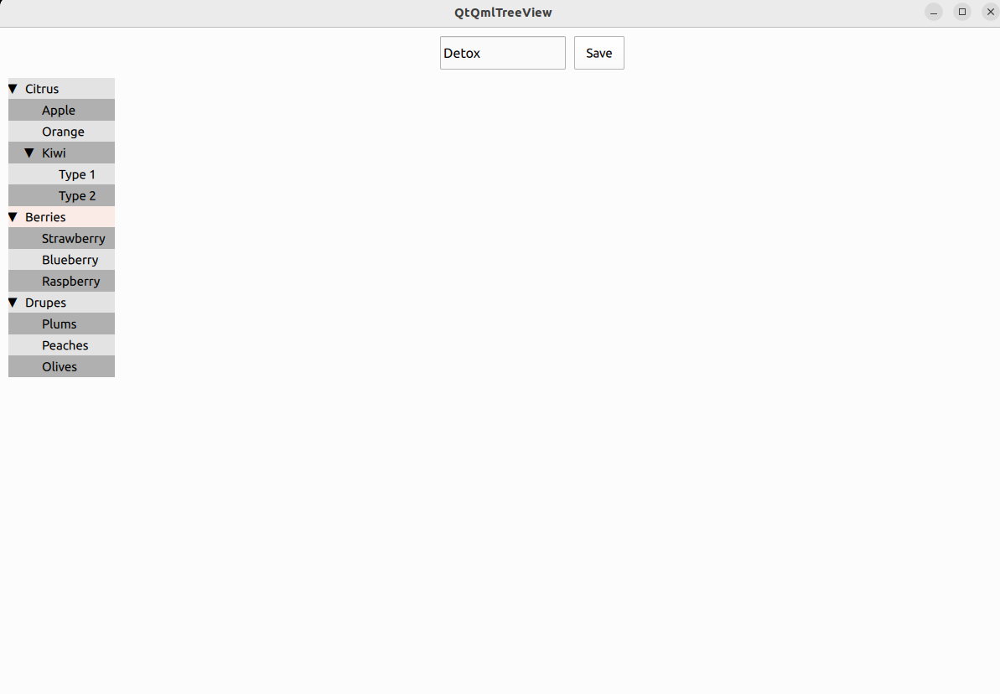

# QtQmlTreeView
QtQmlTreeView is a demo to rendering/managing a dynamic tree from JSON data with nested nodes of various types.

## TreeView Create From JSON file

## TreeView Created From Dynamic Context

